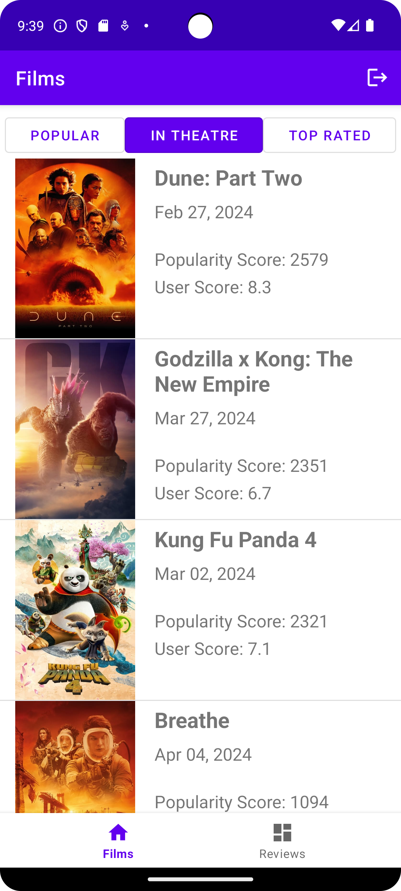
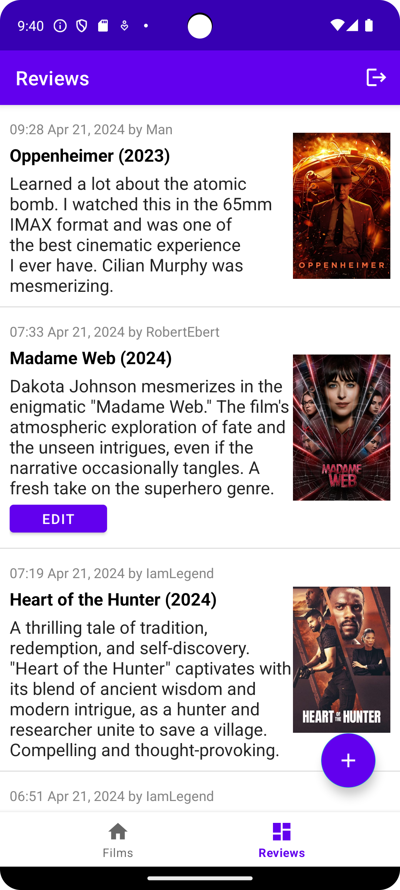

# Cinemate (inspired by [Letterboxd](https://letterboxd.com/) and [The Movie Database](https://www.themoviedb.org/))

## Project Details & Description

- On **Homepage** you can see the current popular, trending, and popular movies fetched from [The Movie Database](https://www.themoviedb.org/).
  - You can view more details of specific movies
- On **Reviews** you can see all the reviews on the platform and edit your reviews.

## Demo Video

## Screenshots
        
        

## Tools Used
- Android Studio
- Git and Github
- Google Firebase

## Sources, Materials, Copyright
- API used: [The Movie Database](https://www.themoviedb.org/)